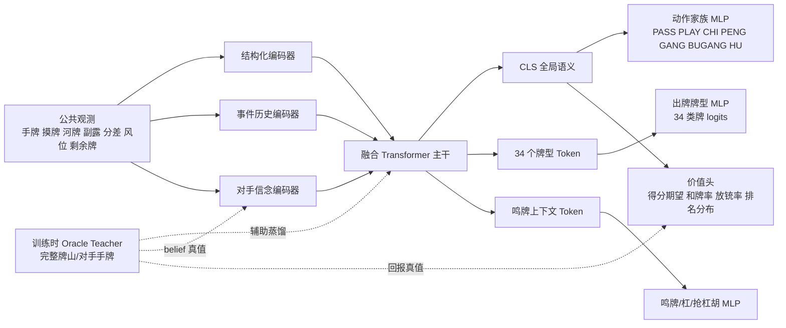
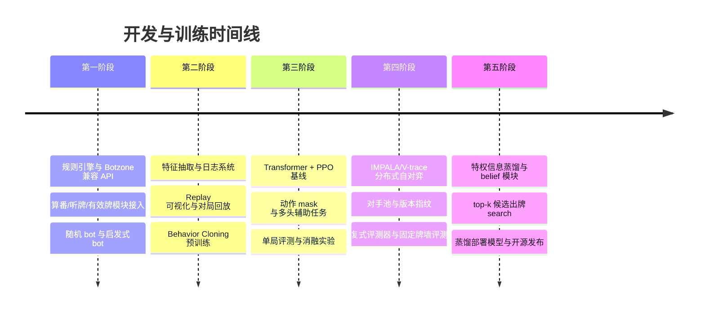

# 国标麻将开源智能体研究与实现计划

## 执行摘要

国标麻将智能体的核心难点，不在“把规则写对”，而在同时处理四人博弈、非完全信息、延迟奖励、可变合法动作、番种约束和较强随机性。以 Botzone 国标实现为代表的公开竞赛规则表明：标准国标是四人非完全信息游戏，正式比赛通常打满四圈共十六局；而 Botzone 基础对局将其简化为单局，8 番起和，且交互协议里大量关键状态只以公共事件形式暴露，例如他家摸牌只显示 `DRAW` 而不显示具体牌、暗杠后其余三家不知道暗杠内容，这意味着你的模型必须显式做“隐状态估计”，而不是只做盘面分类。Botzone 的复式赛制进一步说明，用固定牌墙与座次全排列的方式可以显著降低运气噪声，这对训练后评估非常重要。citeturn40view1turn42view0turn40view0turn13view0

对你的项目，最推荐的主线不是“直接上一个纯 PPO + 纯 token Transformer”，而是采用**分阶段、可扩展、可复现**的路线：先做一个**规则与评测解耦的引擎**，再做一个**混合状态表示**（显式规则特征 + 公共历史 token + 对手信念分布），接着用**Transformer 主干 + 分层 MLP 动作头**作为统一模型骨架；训练上先用**规则启发式/离线模仿学习**解决冷启动，再上 **PPO 作为 MVP 基线**，最终切到 **IMPALA/V-trace 风格的分布式自对弈**提升样本效率和并行扩展性。训练时应加入**特权信息辅助任务**，例如对手手牌重建、最终回报预测、番型路线预测，这与 Suphx 的 oracle guiding、global reward prediction、run-time policy adaptation 思路一致；同时又借鉴 kanachan 的课程式微调思路，先学易目标，再学更抽象目标。你的作业说明本身也已经把“特征、奖励、算法、模型、参数调优”列为优化方向，并给出 PPO/CNN 基线与 Botzone 用户空间约束，因此本报告的路线图会把“先可运行，再可扩展，再可公开复现”放在第一位。citeturn25view1turn34view0turn34view1turn34view2turn43view2turn14academia0turn14academia2 fileciteturn0file0

如果只保留一句最重要的建议，那就是：**把国标麻将当成“部分可观测、带规则结构的多智能体序列决策问题”来做，而不是当成一个只看当前牌面的静态分类问题。** 这会直接决定你的特征设计、奖励设计、动作头分解和训练框架是否能持续扩展。citeturn25view1turn31academia0turn38academia1

## 任务边界与规则落地

建议你把项目拆成两个清晰层次：**规则引擎层**与**训练/评测层**。规则引擎层尽量参数化，支持“正式国标模式”“Botzone 单局模式”“Botzone 复式评测模式”三种配置；训练/评测层则在这些规则配置上共享同一套 observation、action、reward API。这样做的原因很直接：正式国标通常四圈十六局、144 张牌含 8 张花牌；Botzone 基础赛制是单局；而复式赛制又使用 136 张牌、不含花牌、固定牌墙、座次全排列，并以排名分汇总来降低随机性。把这些差异固化进同一个硬编码环境，后面几乎一定会重构。citeturn40view1turn40view0turn13view0

| 规则事项 | 若做正式国标实现 | 若做 Botzone 单局兼容 | 若做 Botzone 复式评测 | 项目默认建议 |
|---|---|---|---|---|
| 对局粒度 | 十六局一场 | 单局一回合 | 固定牌墙下多盘对比 | 训练用单局，正式评测同时报告单局与多局 |
| 用牌 | 144 张，含花牌 | 基础规则含花牌 | 136 张，不含花牌 | 规则引擎支持 `flowers=true/false` |
| 吃碰杠 | 支持吃、碰、明杠、补杠、暗杠 | 同上 | 同上，但摸牌/荒牌细则不同 | 默认全开，严禁训练时删规则偷简化 |
| 荒牌 | 应按具体规则结算 | Botzone 基础规则为牌墙耗尽则平局 | 一家牌墙为空后有专门限制 | 作为可配置结算策略，不硬写死 |
| 同时和牌 | 依实现规则而定 | Botzone 只允许一位和牌者，按逆时针优先 | 同单局规则 | 默认为 Botzone 优先级，另保留扩展接口 |
| 计分目标 | 小分与整场名次都重要 | 单局得分 delta | 以“一副一比”的排名分更稳健 | 训练主目标用单局得分，评估加排名分 |

上表综合了 Botzone 国标基础规则、复式赛制说明以及竞赛仓库给出的样例与裁判程序接口。尤其值得注意的是：复式赛制不是“锦上添花”，而是减少方差、提高评测说服力的关键设计，建议你从项目初期就把它做进 evaluator。citeturn40view1turn40view0turn13view0

对动作空间，建议严格按**阶段化合法动作**建模，而不是扁平硬枚举。Botzone 交互协议清楚说明了两类核心决策面：其一是**自家摸牌后**可做 `PLAY / GANG / BUGANG / HU`；其二是**他家出牌后**可做 `PASS / PENG / CHI / GANG / HU`，且优先级为“和牌 > 碰/杠 > 吃牌”。此外，部分操作是否成功需要在下一回合输入中自行判断，说明环境层必须精确模拟“意图—裁定—后续观测”的时序，而不是把动作成功与否当作即时已知。更重要的是，Botzone 明确规定：非法动作、错和、未到 8 番和牌都会导致该玩家 -30，其余玩家 +10，游戏立刻结束；每步还有限时。这意味着**动作 mask、规则单元测试与 legality CI** 不只是工程优化，而是部署生死线。citeturn42view0

工程上不要从零手写所有裁判逻辑。公开的 `ailab-pku/Chinese-Standard-Mahjong` 仓库已经给出 judge、mahjong-rules、sample-bot 与 fan-calculator 使用说明；Botzone 运行时还自带 `MahjongFanCalculator`，而 `ChineseOfficialMahjongHelper` 提供了算番、听牌、有效牌、上听数等相关算法模块。这些现成组件非常适合作为你的“规则真值源”和“启发式标签源”，先用它们保证正确性，再在模型层做创新。citeturn13view0turn12view0turn22view0

## 状态表示与特征工程

最推荐的表示不是纯 one-hot 平面，也不是纯 token 化，而是**混合表示**：把“明确有规则语义、数据量又不够大到放任模型自己学出来”的部分显式编码，把“顺序依赖强、组合关系复杂、利于注意力建模”的公共历史部分做成 token 序列。这个判断来自几条很有代表性的公开路线：Meowjong 用紧凑二维结构编码可观测信息并为不同动作预训练不同 CNN；kanachan 则几乎不做人类手工特征，只保留 token 与数值序列，并强调这需要超大日志数据与更强模型；Transformer 与相对位置表示又说明，序列关系本身非常适合交给自注意力处理。你的项目面向的是国标而非 Mahjong Soul/天凤那种海量公开日志场景，因此**更务实的方案是“hybrid first”**。citeturn36view0turn36view1turn36view2turn43view0turn43view2turn19academia1turn19academia2

建议的核心观测可以写成：

\[
o_t=\{x^{\text{private}}_t, x^{\text{public}}_t, h_t, b_t, m_t\},
\]

其中 \(x^{\text{private}}_t\) 是自家手牌与自家副露，\(x^{\text{public}}_t\) 是公开盘面统计，\(h_t\) 是公共事件历史，\(b_t\) 是对手隐状态信念，\(m_t\) 是合法动作 mask。这里最关键的不是“信息多”，而是**把确定信息与不确定信息区分开**：他家摸到什么牌、暗杠的具体牌、他家手牌组成，都不应伪装成确定特征，而应进 belief module。Botzone 的协议已经明示了他家摸牌是隐藏的、暗杠内容对他家不可见，这部分若处理成“空缺 one-hot”会比显式后验分布更吃亏。citeturn42view0

| 特征族 | 具体内容 | 推荐编码 | 训练用途 |
|---|---|---|---|
| 自家手牌 | 34 种常规牌计数、自家摸入牌、可形成的面子/对子/搭子 | 34 个 tile token + count embedding + 手牌角色 embedding | 出牌、听牌进展、模板命中 |
| 自家副露 | 吃/碰/明杠/补杠/暗杠、面子类型与来源玩家 | meld token，含类型、中心牌、相对座位 | 番种潜力、危险度、回合节奏 |
| 公共河牌 | 四家弃牌顺序、每次弃牌时刻、是否在鸣牌后打出 | event token 序列 | 安全牌、对手路线、节奏判断 |
| 可见张与剩余牌 | 每种牌已见张数、可能存活张数、剩余摸牌轮次 | count embedding + scalar token | 有效牌、概率估计、风险估计 |
| 风位与局势 | 门风、圈风、庄家、当前分差、名次压力、8 番门槛 | scalar MLP token + relative seat embedding | 风险偏好、是否冲高番 |
| 番种/模板 | 清一色、混一色、对对和型、七对型、幺九/字牌路线等 coarse family 可行性 | sparse binary / multi-hot + template embedding | 番潜力估计、奖励 shaping |
| 听牌/上听数 | deficiency、有效牌数、N 步内听牌概率估计 | scalar + auxiliary head | 进展 shaping、动作排序 |
| 对手隐状态 | 他家每种牌张数后验、可能听牌与番型后验、进攻/防守风格嵌入 | posterior tensor / belief token | 放铳风险、应对策略 |
| 合法动作 | 当前动作家族与每个候选动作是否合法 | action mask | 训练与部署时强约束 |

上表中的 deficiency、有效牌、听牌相关特征，完全值得显式提供给模型：一方面，学术工作表明 deficiency number 在麻将决策里是基础过程量，快速算法能比基线快两个数量级且尊重“可用牌知识”；另一方面，`ChineseOfficialMahjongHelper` 已经把算番、判断听牌、听牌计算、上听数与有效牌计算抽成可复用算法。把这些“规则正确、又能迅速提供 dense signal”的量当作辅助输入或辅助标签，几乎总是比让模型从零学更划算。citeturn35view1turn37view0turn22view0

下面这张表更适合指导你做“表示版本选择”。

| 编码方案 | 优点 | 缺点 | 计算成本 | 适合阶段 |
|---|---|---|---|---|
| 纯 count plane / one-hot 平面 | 简单、稳定、利于 CNN/PPO baseline | 时序信息弱；对隐状态和多动作家族表达差 | 低 | MVP 基线 |
| 纯 token 序列 | 统一、灵活、适合 Transformer；可少做特征工程 | 对数据量要求高；小数据时不稳定 | 中 | 大规模离线预训练或后期研究 |
| 混合表示 | 同时保留规则先验与序列建模能力；最稳妥 | 工程复杂度更高 | 中 | 推荐主线 |
| 粒子世界采样 | 最贴近不确定性本质，能做 search-time averaging | 推理代价高；训练实现复杂 | 高 | 仅用于高端版本或搜索时 |

这个对比综合了 Meowjong 的紧凑二维可观测编码、kanachan 的“几乎无手工特征”token 路线、Transformer/相对位置建模，以及国标协议里对隐藏信息与公共事件的明确区分。就你的目标——样本效率、自对弈扩展性、开源可复现——而言，**混合表示**最平衡。citeturn36view0turn43view0turn43view2turn19academia1turn19academia2turn42view0

对不确定性，建议使用**“后验分布 + 小样本粒子”两级方案**。训练主干时，用 belief network 输出

\[
q_\psi(c_{o,t}^{(k)} \mid h_t),
\]

即“对手 \(o\) 在时刻 \(t\) 拥有第 \(k\) 类牌的张数后验”；训练时用自对弈产生的完整真值手牌做监督：

\[
L_{\text{belief}}=\sum_{o,k}\mathrm{CE}\!\left(q_\psi(c_{o,t}^{(k)} \mid h_t), c^{\text{oracle}}_{o,t,k}\right).
\]

部署时只保留 student belief，不暴露 oracle。若到高阶版本，再对 top-k 候选出牌做少量粒子平均：

\[
Q(a\mid h_t)\approx \frac{1}{K}\sum_{j=1}^{K} Q_\theta(a \mid h_t,z_t^{(j)}),\qquad z_t^{(j)}\sim q_\psi(\cdot\mid h_t).
\]

这基本就是把 Suphx 的 oracle guiding 思路、DeepStack/Student of Games 的“搜索 + 学习 + 不完全信息推理”思想，落到一个工程上可实现的学生网络框架中。citeturn25view1turn31academia0turn38academia1

数据增强方面，最值得做的是**花色对称置换**、**座次旋转**、**固定牌墙复用**、**稀有事件重采样**。前三者能显著增加有效样本、减少策略偶然性；固定牌墙复用还天然服务于 duplicate evaluation。这里不用追求“炫技式增强”，只要让同一决策逻辑在不同风位、不同花色映射下保持一致即可。citeturn40view0turn40view1

## 额外信息、启发式与奖励设计

你问到“训练时怎样引入额外信息、经验规律”，这里最关键的原则是：**训练时可以看得更多，部署时必须守规矩。** 这正是麻将这类不完全信息博弈里最有效、也最容易做错的地方。Suphx 明确把 oracle guiding 作为关键技术之一；你的作业说明也明确允许你在特征、奖励、算法、模型上做扩展。因此，最推荐的实现不是把隐藏信息直接喂给线上策略，而是做一个**teacher-student 结构**：teacher 在训练时看到完整状态，用来产生价值辅助目标、对手手牌后验真值、风险真值与策略蒸馏目标；student 只看合法观测，在训练中逼近 teacher，但在推理时独立运行。citeturn25view1turn34view0 fileciteturn0file0

| 启发式/额外信息 | 如何计算 | 如何融入训练 | 建议是否在线保留 |
|---|---|---|---|
| 安全牌估计 | 基于可见张、对手弃牌顺序、对手听牌后验，估计某张牌放铳概率 | 作为辅助输入 + 风险惩罚 + 排序标签 | 保留 |
| 舍牌优先级 | 搭子效率、对子/刻子价值、孤张惩罚、保留高番模板灵活度 | 行为克隆标签、辅助 KL、候选动作重排 | 保留 |
| 听牌价值评估 | 听牌概率 × 预期和牌分 − 放铳损失 | shaping 和 value head | 保留 |
| 放铳风险评估 | \(p_{\text{dealin}}\times E[\text{loss}]\) | step reward 惩罚、margin loss | 保留 |
| 番型模板库 | coarse family 可达性与最大发电番潜力 | 模板多标签辅助任务、潜势函数 | 保留 |
| 对手风格 embedding | 过去出牌/副露/进攻频率统计 | 作为 opponent encoder 输入 | 保留 |
| 完整手牌 oracle | 自对弈真值 | teacher-student 蒸馏、belief 监督 | **仅训练时** |
| 全局最优/搜索标签 | 粒子采样或 teacher search 的 top-k 排序 | 离线预训练、DAgger、re-ranking | 仅训练或高配推理 |

上表最值得优先做的，不是“复杂搜索老师”，而是四个便宜又高价值的信号：**deficiency、有效牌数、放铳风险、番潜力**。它们能直接服务特征、奖励和解释性，而且已有论文与开源实现支撑。若你后续想做解释性工具，Mxplainer 说明“从强麻将 agent 上做忠实模仿，再把其策略解释出来”是可行路线，这也反过来说明：你的 teacher/student 日志系统从一开始就该保留。citeturn35view1turn37view0turn35view0turn39view0turn22view0

奖励函数建议采用**“终局主导 + 潜势 shaping + 风险惩罚 + 辅助预测”**的四层结构。不要把所有启发式都直接加成最终 reward，否则非常容易学出为了局部指标而牺牲终局胜率的策略。更稳妥的做法是把终局得分或排名分作为主奖励，把规则启发式写成潜势函数，只在 step reward 中加入“状态势能变化”，这样更接近不改变最优策略集的 reward shaping 思路。citeturn32academia0turn32academia1turn25view1turn40view0

| 奖励结构 | 数学形式草案 | 优点 | 风险 | 推荐阶段 |
|---|---|---|---|---|
| 稀疏终局得分 | \(R_T=\tanh(\Delta score/c)\) | 最接近真实目标 | 学习慢、信用分配差 | 所有阶段都保留 |
| 终局 + 潜势 shaping | \(r'_t=r_t+\lambda(\gamma\Phi(s_{t+1})-\Phi(s_t))\) | 稳定加速早期学习 | \(\Phi\) 设计差会误导策略 | 主推荐 |
| 风险感知奖励 | \(-\eta\, \hat p_{\text{dealin}} \hat L\) | 能显著抑制放铳 | 容易过度保守 | 中后期加入 |
| 复式排名奖励 | 按固定牌墙对比后的排名分 | 评测更稳、与赛事一致 | 反馈更稀疏 | 评测与后期 fine-tune |
| 偏好/IRL 奖励 | 由人类或强 agent 偏好学习 reward model | 可学“人味”与强策略偏好 | 数据成本高 | 研究增强项 |

如果写成一个可直接落地的主 reward，我建议从下面这个版本开始：

\[
R_T=\tanh\!\left(\frac{\Delta score_i}{c}\right),
\]

\[
\Phi(s)= -\alpha d(s)+\beta \log(1+u(s))+\gamma \hat f_{\max}(s)-\eta \hat p_{\text{dealin}}(s)\hat L(s),
\]

\[
r_t=
\begin{cases}
R_T, & t=T\\
\lambda\big(\gamma \Phi(s_{t+1})-\Phi(s_t)\big), & t<T
\end{cases}
\]

其中 \(d(s)\) 是 deficiency / 上听数，\(u(s)\) 是有效牌数，\(\hat f_{\max}(s)\) 是当前最有希望达到的番潜力估计，\(\hat p_{\text{dealin}}(s)\hat L(s)\) 是放铳风险期望损失。这样做的重点不在“公式漂亮”，而在把你真正关心的长期目标——赢、少放铳、尽量高番——统一到一个可控的势能框架里。deficiency 和有效牌的可计算性已有直接研究支撑，而将 shaping 写成 potential 形式可以尽量减少目标漂移。citeturn35view1turn37view0turn32academia0turn32academia1

另一个强烈建议是加入**全局回报预测辅助头**。Suphx 把 global reward prediction 作为核心技术之一，这对麻将这种超延迟回报任务尤其自然。你可以在每个决策点额外预测最终归一化得分、和牌概率、放铳概率、目标番数区间，形成多任务损失：

\[
L = L_{\text{policy}} + \lambda_v L_{\text{value}} + \lambda_g L_{\text{global}} + \lambda_b L_{\text{belief}} + \lambda_f L_{\text{fan-template}}.
\]

这样做的最大价值，是让 Transformer 主干更早学到“现在这步会把局面推向哪里”，而不仅仅学“当前该出什么”。citeturn25view1turn34view1

自对弈中的非平稳性，则建议从一开始就通过**对手池 + 版本指纹 + 周期冻结评测**处理。Foerster 等工作指出，多智能体场景下经验回放会因为策略分布漂移而变得不稳定，解决办法之一是用数据年龄/策略指纹去标记旧经验；而 IMPALA、Ape-X、OpenAI Five 的启发则是使用 actor-learner 解耦与持续训练工具链来吸收大规模数据。落地上，你至少要维护一个 opponent pool：最新 checkpoint、若干历史强点、启发式 bot、随机 bot，各自按一定混合概率参与自对弈。citeturn20academia3turn14academia0turn17academia2turn16academia1

## 强化学习算法路线

国标麻将对算法的要求很“刁钻”：动作是**离散但合法集合随回合变化**，观测是**部分可见**，奖励是**长时延**，而且四人博弈既非简单零和，也不适合直接套完美信息博弈范式。RLCard 把麻将环境的状态空间和信息集空间都列得极大，这种量级本身就提醒你：纯靠一个简单 on-policy 算法硬怼，很容易训练很久只学到一个“还算合法”的保守 bot。citeturn10view2turn25view1turn40view1

| 算法 | 样本效率 | 稳定性 | 自对弈扩展性 | 对离散 masked action 的适配 | 推荐结论 |
|---|---|---|---|---|---|
| PPO | 中 | 高 | 中 | 很好 | **最快 MVP**，也是最安全的第一阶段 |
| A2C/A3C | 中偏低 | 中 | 中高 | 很好 | 可作轻量并行基线，但通常不如 PPO 稳 |
| IMPALA / V-trace | 高 | 高 | **很高** | 很好 | **主推荐生产训练方案** |
| R2D2 / 分布式 recurrent replay / QR-DQN | 高 | 中 | 高 | 好，但要认真处理 replay 非平稳 | 适合作为高样本效率备选 |
| DouZero 风格 MC + 动作编码 | 高 | 中高 | 高 | **非常适合可变合法动作** | 值得重点关注的强备选 |
| AlphaZero / Polygames + MCTS | 中 | 高 | 高，但算力重 | 完美信息更自然；麻将需 belief/search 扩展 | 适合做高配推理，不适合先做 MVP |
| NFSP / MC-NFSP / Student of Games | 中 | 中高 | 中 | 理论上很对题 | 研究价值高，但工程复杂，不建议首发 |
| SAC / DDPG / TD3 | 高于 PPO 于连续控制 | 高 | 中 | 对离散麻将动作不自然 | **不推荐作为主线** |

这个比较主要依据 PPO、A3C、SAC、TD3、IMPALA、QR-DQN、NFSP/MC-NFSP、DouZero、AlphaZero、Student of Games、DeepStack 与 OpenAI Five 等公开论文/系统。尤其是 DouZero 的经验非常值得你重视：斗地主同样是多人、不完全信息、合法动作集合剧烈变化的纸牌/牌类博弈，论文明确指出“很多现代 RL 在这种大变动作空间下并不理想”，而他们用**Monte Carlo + 动作编码 + 并行 actor** 在几天内就打到了 Botzone 第一。这与麻将的动作结构有很强的方法论相似性。citeturn14academia2turn30academia2turn14academia1turn17academia0turn14academia0turn16academia0turn21academia1turn30academia0turn41view0turn15academia0turn24view0turn38academia1turn31academia0turn16academia1

**主方案**我建议定为：**离线预训练 + IMPALA/V-trace 分布式自对弈 + Transformer actor-critic + 特权辅助任务**。理由有四个。第一，IMPALA 的 actor-learner 解耦和 V-trace 修正对并行自对弈非常友好；第二，离散 masked action 与 actor-critic 头天然兼容；第三，分布式训练更容易把 Botzone/本地模拟器/向量化环境接在一起；第四，后面要加 opponent pool、belief 辅助头、teacher-student 蒸馏时，比纯 value-based 路线更顺手。citeturn14academia0turn20academia3turn16academia1

**最快可交付的备选方案**则是：**PPO + 同一个 Transformer 架构 + 动作 mask + dense auxiliary heads**。PPO 的好处不在“最终一定最强”，而在于实验迭代最短、复现门槛最低、调参社区经验最多，也与你作业基线直接衔接。你完全可以用 PPO 完成第一版开源发布，然后保持 observation、policy head、evaluator 不变，把 learner 替换到 IMPALA。这样迁移成本最小。citeturn14academia2 fileciteturn0file0

**强备选方案**我会给两个。第一个是 **DouZero 风格合法动作评分器**：把每个 legal action 单独编码，再由网络打分选 argmax，这种范式非常适合“不同回合合法动作集合差异极大”的国标麻将；第二个是 **R2D2/QR-DQN 风格的序列 replay 价值学习器**，尤其当你发现 actor-critic 的 value 方差太大时，可以引入分布式 critic 或分位数价值来稳住训练。不过这两条路线都比 PPO/IMPALA 更依赖经验回放细节与数据版本控制。citeturn41view0turn16academia0turn20academia3

至于 **AlphaZero/Polygames**，它们带来的最大启发是“策略/价值网络 + 搜索”这一范式，而不是直接照搬。AlphaZero 是为国际象棋、将棋、围棋这类完美信息博弈设计的；Student of Games 则更明确地把 guided search、self-play learning、game-theoretic reasoning 融到不完全信息游戏中。对你的项目，这意味着一个更现实的版本：**先学强 policy/value，再只对 top-k 出牌做小规模 belief-conditioned search**，而不是一开始就做全局 MCTS。citeturn15academia0turn24view0turn38academia1turn31academia0

SAC、DDPG、TD3 不建议做主路线，原因并不神秘：这些方法的漂亮结果主要来自连续控制，麻将动作本质上是离散、阶段化、规则强约束的。除非你专门研究“动作嵌入检索”一类变体，否则把精力放在离散 masked action 的 actor-critic 或 action-scoring 上，收益更高。citeturn14academia1turn17academia0

## Transformer 主干与决策头设计

你的“Transformer 主干 + 下游 MLP 决定出牌牌型”的想法是可行的，而且是我推荐的主架构。关键不是“用不用 Transformer”，而是**Transformer 看到什么 token、MLP 头怎么分解动作**。Transformer 的优势是并行建模异质序列关系；相对位置表示对顺序和关系建模尤其重要；而棋类/麻将类开源实践又表明，既可以走 kanachan 这种几乎全 token 化路线，也可以走 Meowjong 这种动作分拆路线。所以最稳妥的架构是：**结构化摘要 token + 公共事件 history token + belief token 进入共享 Transformer，再用分层 MLP 头分别做动作家族判断与具体动作选择。** citeturn19academia1turn19academia2turn43view0turn36view0turn19academia0

| 模块 | 建议设计 | 输入/输出 | 说明 |
|---|---|---|---|
| 结构化特征编码器 | 小 MLP + embedding sum | 标量/计数 → 16–32 个 summary token | 编码风位、分差、见牌数、剩余牌等 |
| 公共历史编码器 | event embedding | 最近 96–128 条公共事件 → history token 序列 | 编码 `DRAW/PLAY/CHI/PENG/GANG/BUGANG/HU` 等时序 |
| 手牌/副露编码器 | tile token + meld token | 34 个 tile token + 最多若干 meld token | 为出牌 head 提供按牌位细粒度表示 |
| belief 编码器 | posterior MLP → belief token | 3 家对手后验分布 → 6–12 个 belief token | 显式建模隐状态不确定性 |
| 融合 Transformer 主干 | 6–10 层，双向注意力 | 全部 token → contextualized token | 共享主干，训练时可加 teacher 辅助损失 |
| 动作家族头 | CLS token → MLP | 输出 PASS / PLAY / CHI / PENG / GANG / BUGANG / HU | 先判“做哪类动作” |
| 出牌牌型头 | 34 个 tile token → MLP | 输出 34 类常规牌 logits | 按牌型选弃牌，配合法动作 mask |
| 吃牌/鸣牌头 | 当前上下文 token → 小 MLP | 输出吃的中张、碰后打什么、是否杠等 | 单独 head 降低类别不平衡干扰 |
| 价值头 | CLS token → MLP | 输出得分期望、和牌概率、放铳概率、排名分布 | 多任务 value，缓解延迟奖励 |

这个结构综合了 Botzone 的阶段化动作接口、Meowjong 的分动作建模思路、Transformer 的序列建模优势，以及 Suphx 的全局回报思路。尤其在国标里，**动作家族头和具体出牌头分开**非常重要：这会让“我现在要不要碰/吃/杠/胡”与“如果是 PLAY，该打哪张”成为两个更稳定的学习问题。citeturn42view0turn36view0turn25view1



关于具体超参数，我建议直接定义三档配置，而不要只堆一个“大模型”：

| 档位 | d_model | 层数 | 头数 | FFN | 估计参数量 | 用途 |
|---|---:|---:|---:|---:|---:|---|
| Tiny | 192 | 6 | 6 | 768 | 约 4–5M | 本地调试、快速 PPO 基线、CI |
| Base | 256 | 8 | 8 | 1024 | 约 7–9M | **主训练/主发布档** |
| Research | 384 | 10 | 8 | 1536 | 约 20M+ | 研究版、蒸馏 teacher |

在 Botzone 语境下，每步有时间限制，因此即便不极端压缩，也建议把线上部署模型控制在 **Base 或 Tiny 蒸馏版**。训练时可用 Research/Base 当 teacher，最终蒸馏到 Tiny/Base 上线。citeturn42view0 fileciteturn0file0

有三个架构决策建议你尽量别走弯路。第一，**用双向 Transformer，不用 causal Transformer 做主干**；因为你在每个决策点已经拿到了完整当前观测，不是在做序列生成。第二，**位置编码用相对位置优先**，特别是历史事件序列和座位相对关系。第三，**区分“牌类型”和“牌所处角色”**，同一张牌在手里、在河里、在副露中，语义完全不同；kanachan 的 token 设计就非常强调这一点。citeturn19academia2turn43view0turn43view2

价值网络与策略网络我建议采用**共享前部主干、分离后部 head** 的折中方案。也就是说，Transformer 共享，但策略 head、价值 head、belief head 都用独立 MLP；如果后面你发现政策与数值损失冲突严重，再把最后 1–2 层改成 policy adapter / value adapter。若收益方差较大，还可以把 value 头升级成**分布式/分位数价值头**，学习回报分布而不仅仅是均值，这对麻将这种高方差任务通常比单标量 value 更稳。citeturn16academia0turn25view1

## 训练工程、评估与开源复现

训练工程上，最重要的是把“环境吞吐、模型推理、版本管理、评测方差控制”四件事同时设计出来。Mjx 给出了很好的工程示范：Gym-like API、分布式 gRPC 服务、批量推理；Mahjax 则说明，麻将环境完全可以做成高度模块化、可向量化的 GPU/JAX 版本，并把吞吐打到很高。对你的项目，即使一开始不做 JAX，也建议把接口设计成将来可以替换后端：`env.reset(seed, ruleset)`、`env.step(action_dict)`、`policy.act_batch(obs_batch, legal_mask)`、`evaluator.run_duplicate(...)`。这样你后面无论换成 C++ 模拟器、PyTorch actor server，还是更快的向量化后端，训练栈都不需要推倒重来。citeturn23view0turn5academia3

推荐的训练流程是：先用启发式 bot、自对弈 teacher 或公开日志做**behavior cloning / offline pretrain**，再做 **PPO 基线收敛验证**，最后切换到 **IMPALA/V-trace 分布式自对弈**。如果走 replay 路线，则对序列切片进行优先抽样，并把策略版本或时间戳作为 fingerprint 写入样本；这可以显著缓解多智能体 replay 过期问题。对手池建议至少包含：最新模型、历史最优若干、启发式风险 bot、纯效率 bot、随机 bot。这样可以抑制策略遗忘，也能让模型不过度 overfit 当前对手。citeturn14academia0turn17academia2turn20academia3turn16academia1



评估指标上，不建议只看“平均得分”。至少要同时维护下面这组指标：

| 指标 | 定义建议 | 为什么重要 |
|---|---|---|
| 复式排名分 | 固定牌墙、座次全排列后的排名分 | 最能抗运气方差 |
| 单局平均得分 | 每局小分均值 | 与 Botzone 单局训练目标直接对应 |
| 和牌率 | 自摸 + 点炮和总频率 | 衡量进攻能力 |
| 放铳率 | 因自己出牌导致他家和牌的频率 | 衡量防守质量 |
| 自摸率 | 自摸和牌频率 | 对主动构型能力敏感 |
| 荒牌听牌率 | 流局时进入听牌/接近听牌的比例 | 衡量中后盘效率 |
| 番数分布 | 和牌番数的均值/分位数 | 判断是否只会“胡小牌” |
| 校准误差 | 和牌概率/放铳概率/Brier score | 检查 risk head 是否可信 |
| 决策延迟 | p50/p95 单步推理时间 | 决定是否能部署 |
| 策略多样性 | 相同局面簇下弃牌分布熵/JSD | 发现坍缩与过拟合 |

Suphx 用稳定段位/排名相关指标衡量强度，Botzone 复式赛制也明确把“降低随机性、提高排名说服力”作为设计目标。因此，**你的主榜单请优先用复式排名分，单局平均得分作为辅助图表。** citeturn25view1turn40view0turn40view1

A/B 测试建议采用**固定牌墙 paired evaluation**：同一批牌墙、同一组对手、全座次轮换，对比模型 A 与 B 的排名分和小分差异。统计显著性则用 paired bootstrap 置信区间或置换检验，不要只看几百局的裸均值。Botzone 复式赛制已经从制度上帮你做了很大一部分方差削减；而扑克评测工作也反复强调，在高方差博弈里做方差控制是严肃评测的前提。citeturn40view0turn31academia4turn31academia0

开源结构上，建议把“规则、特征、模型、训练、评测、可视化”彻底拆开。一个足够好用的目录可以是：

```text
mahjong-agent/
  configs/
    rules/
    model/
    train/
    eval/
  mahjong_gb/
    engine/
    rulesets/
    fan/
    shanten/
    features/
    belief/
    models/
    learners/
    selfplay/
    search/
    evaluation/
    api/
    viz/
  scripts/
    train_bc.py
    train_ppo.py
    train_impala.py
    eval_duplicate.py
    play_botzone.py
    export_onnx.py
  tests/
    test_rules.py
    test_legality.py
    test_fan_examples.py
    test_observation.py
    test_duplicate_eval.py
  docs/
    rules.md
    training.md
    reproducibility.md
```

`Chinese-Standard-Mahjong` 仓库提供了 judge、sample bot 与 fan-calculator，用于建立 golden tests 非常合适；Mjx 的 gym-like API 与 server 模式则很适合作为你自己 API 设计的工程参考。citeturn13view0turn23view0

复现性上，请至少固定四件东西：**ruleset hash、代码 commit hash、训练 seed、评测牌墙 seed**。每个 checkpoint 附带一个 `metadata.json`，记录训练算法、奖励权重、对手池组成、编译版本、onnx 导出版本。CI 里至少跑三类测试：规则合法性测试、算番/听牌黄金案例测试、固定牌墙回归测试。可视化建议做两类：对局回放器与策略热力图；如果后面你做解释模块，可以借鉴 Mxplainer 那种“top-k 行动解释 + 规则模板贡献”的形式。citeturn39view0turn23view0turn5academia3

## MVP 里程碑与检索资源

如果你的目标是“尽快做出一个能公开、能自对弈、能评测、后续还能继续长”的项目，我建议把 MVP 切成下面五步，而不是一开始就追求“像 Suphx 一样强”。

| 里程碑 | 必做产物 | 完成标准 |
|---|---|---|
| 规则 MVP | 规则引擎、Botzone adapter、合法动作 mask、算番/听牌模块 | 零非法动作；与 judge 对齐；固定案例全过 |
| 基线 MVP | 随机 bot、启发式 bot、复式 evaluator | 启发式 bot 稳定优于随机 bot |
| 模型 MVP | Hybrid observation、Transformer 主干、分层 MLP 头 | 能完成行为克隆训练并收敛 |
| RL MVP | PPO 自对弈训练脚本、日志与 checkpoint 管线 | 稳定优于启发式 bot |
| 扩展 MVP | IMPALA/V-trace、belief 辅助头、duplicate A/B、对局可视化 | 复式评测稳定提升，具备开源发布条件 |

这个顺序的好处在于：每一步都能单独交付、单独测试、单独开源，而且不会因为“后续想上更复杂算法”就推翻已有资产。特别是第一步和第二步，别嫌“土”，它们决定你后面是不是能快速定位 reward、特征、模型到底是谁出了问题。citeturn13view0turn22view0turn40view0

检索资源我建议按“规则—工具—麻将 AI—通用 RL 博弈”四层组织。优先站点是：**Botzone Wiki 与 `ailab-pku/Chinese-Standard-Mahjong` 仓库**用于规则与交互；**`ChineseOfficialMahjongHelper`** 用于听牌/算番/有效牌；**arXiv** 用于 Suphx、reward shaping、deficiency、Meowjong、DouZero、Student of Games、IMPALA 等论文；**GitHub** 用于 `kanachan`、`mjx`、`Polygames` 等工程参考。若只列关键词，中文可用“国标麻将 AI / 国标麻将 Botzone / 算番 听牌 有效牌 / 上听数 / 复式赛制 / 自对弈 强化学习”；英文可用 “Chinese Standard Mahjong”, “Mahjong AI”, “deficiency number mahjong”, “reward shaping mahjong”, “oracle guiding mahjong”, “IMPALA self-play”, “Student of Games”, “DouZero action encoding”, “Transformer mahjong”。citeturn13view0turn12view0turn22view0turn25view1turn35view1turn37view0turn36view0turn41view0turn38academia1turn23view0turn24view0turn43view0

最后把优先级再压缩成一句“开工清单”：**先做规则与评测，接入算番/听牌/有效牌；再做启发式 teacher；然后上 Hybrid Transformer + PPO；等基线跑通后，再切 IMPALA、自对弈对手池与特权蒸馏；评测始终用复式固定牌墙。** 这条路径最符合你要求的样本效率、可扩展自对弈训练和开源可复现性。citeturn14academia0turn14academia2turn40view0turn25view1turn43view2

**Open questions / limitations**

仍有几项细节需要在实现前明确，且公开材料并没有完全替你做决定。第一，若你不以 Botzone 为唯一目标，**正式国标完整结算细则与多局 match 目标**应进一步确定，否则 reward 与 evaluator 会摇摆。第二，**中国官方标准的大规模公开高质量牌谱资源相对稀缺**，至少从公开项目形态看，现成资源主要集中在规则、裁判与少量样例 bot，而像 kanachan 这样的大模型路线严重依赖海量日志，因此你大概率需要把自对弈放在主数据源位置。第三，若后续想做 search-time belief planning，需要额外权衡推理延迟与线上预算。建议你把这些当作配置项而不是先验假设写死。citeturn13view0turn43view0turn23view0turn42view0